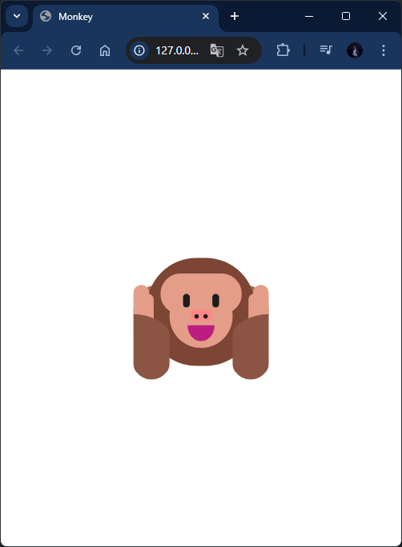
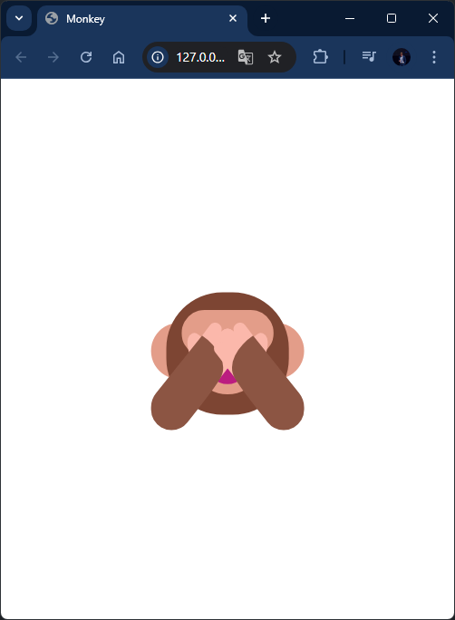

# 🐵 Peek-a-Boo Monkey

A fun and interactive monkey animation built with **HTML**, **CSS**, and **JavaScript**. The monkey covers its eyes with its hands, and when you click on it, the monkey removes its hands, revealing its eyes—click again to toggle the hands back over the eyes. This project was inspired by the tutorial from [Brian Design](https://www.youtube.com/@briandesign).

## 🚀 Features

- Clickable animation where the monkey alternates between covering and uncovering its eyes.
- Purely built with HTML, CSS, and JavaScript for smooth interaction.

## 🛠️ Technologies Used

- **HTML**: Structure of the monkey and page.
- **CSS**: Styles and animations for the monkey's movement.
- **JavaScript**: Click logic to toggle between hand positions.

## 📋 Usage

1. Clone the repository:

   ```bash
   git clone https://github.com/your-username/peekaboo-monkey.git
   ```

2. Open the `index.html` file in your browser to interact with the monkey.

3. Check out the live demo on **GitHub Pages** [here](https://your-username.github.io/peekaboo-monkey).

## 🎥 Tutorial Reference

This project follows the tutorial by **Brian Design**:
- YouTube Tutorial: [Build 3 Beginner Javascript Projects in 30 mins Tutorial - HTML, CSS & JS](https://www.youtube.com/watch?v=mCQ1-iDSnto&t=53s)

## 🌐 Deployment

The project has been deployed using **GitHub Pages** and can be viewed [here](https://viorelss.github.io/JS_Monkey).

## 🤝 Contributing

Contributions are always welcome! Feel free to fork the repository, create new branches, and submit pull requests to enhance or modify the project.

1. Fork the repository.
2. Create a new branch (`git checkout -b feature/YourFeature`).
3. Commit your changes (`git commit -m 'Add some feature'`).
4. Push to the branch (`git push origin feature/YourFeature`).
5. Open a pull request.

---

### 🖼️ Project Screenshots

<div style="display: flex; justify-content: space-between;">
  
  
</div>
